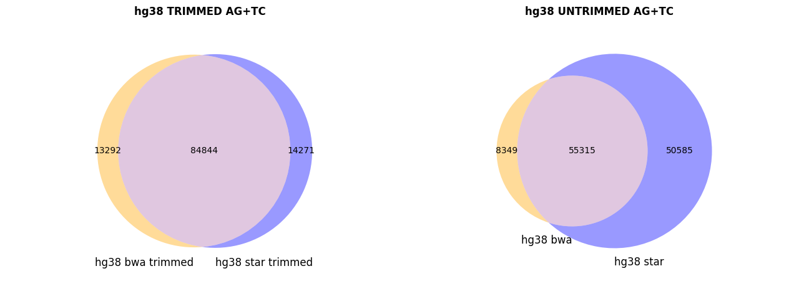

<h1>Venn_diagram.py</h1>

This script allows users to generate a Venn Diagram like that reported in Fig.1.
The output is in .png format, to change it we suggest to use tools like <a href="https://www.gimp.org/">GIMP</a>

<Usage:>
>python Venn_diagram.py groupA groupB

An example file for input is also provided here
