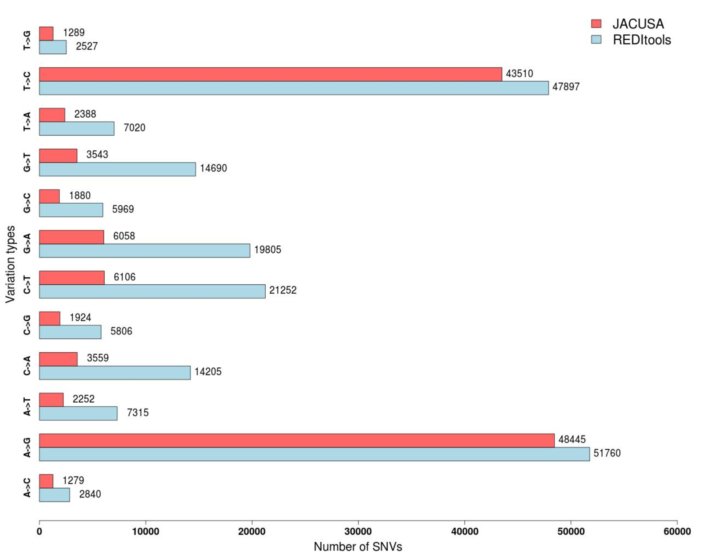

<h1>Fig2.tiff R code.</h1>

 Open bash terminal and type: 

> R  
> jpeg("Fig2.jpg",width=1280,height=1024) #png("test.png",width=1280,height=1024)  
> par(mar = c(5, 5, 1, 3)) # bottom, left, top, right   
> a = read.table("STAR_hg19_trimmed_redi2_jacusa_filtered_wgs", header=TRUE)  
> d = data.frame(row.names=a$Var1, redi2_abs_freq=c(a$redi2_Freq), jac_abs_freq=c(a$jac_Freq))  
> d <- do.call(rbind, d)  

> xx = barplot(d, col=c("lightblue","#FF6666"), cex.lab= 1.8, cex.main = 2, cex.axis = 1.5, cex.names = 1.3, beside = TRUE, names.arg=a$Var1 , xlim=range(pretty(c(0,max(d)))), legend.text = c("REDItools","JACUSA") ,args.legend = list(x = "topright", bty="n", cex=2),  horiz=TRUE, xlab="Number of SNVs", ylab="Variation types", font = 2)  
> e = data.frame(row.names=a$Var1, redi2_abs_freqs=c(a$redi2_Freq), jac_abs_freqs=c(a$jac_Freq))  
> f=c(rbind(e[ ,1],e[,2]))  
> text(y = xx, x = d, label = f , pos = 2, offset = -4 , font.axis = 1 , cex = 1.45, col = "black")  
> dev.off()  

 Open bash terminal and type: 

> convert -units PixelsPerInch Fig2.jpg -resample 300 Fig2_300dpi.tiff

Input file is provided <a href="./STAR_hg19_trimmed_redi2_jacusa_filtered_wgs">here</a>.

Output

