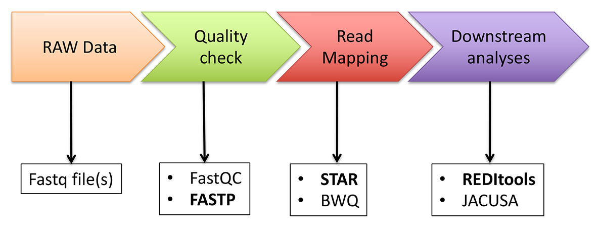

<html xmlns="http://www.w3.org/1999/xhtml">
  <head>
    <meta http-equiv="Content-Type" content="text/html; charset=utf-8" />  
  </head>
  <body>

<h1>QEdit: RNA editing quantification in deep transcriptome data</h1>

 

RNA editing is a co-/post-transcriptional mechanism involving the insertion/deletion or substitution of specific bases in precise RNA localizations. Substitutional RNA editing, mostly by the adenosine to inosine (A-to-I) deamination, is prominent in mammals.
It has profound functional consequences and its deregulation has been linked to a variety of human diseases including neurological and neurodegenerative disorders or cancer.
RNA editing can be profiled in deep transcriptome data but its detection is not trivial. Indeed the number of A-to-I candidates as well as the accuracy of predictions depends on the adopted computational strategy. Individual steps or specific software used can dramatically alter the quality of results.
Quantifying RNA editing is relevant to compare independent samples and study its potential role in different experimental conditions.
Here we provide simple scripts to calculate different metrics for RNA editing quantification.
Although a variety of programs to identify RNA editing candidates in RNAseq data has been released, we will profile inosinomes using <a href="https://github.com/BioinfoUNIBA/REDItools">REDItools</a> and <a href="http://srv00.recas.ba.infn.it/atlas/index.html">REDIportal</a>.

The bioinformatics pipeline used to investigate RNA editing in RNAseq datasets is depicted in the following Figure. Below each step, we report main bioinformatics tools used, whose commad lines are included in this repository.

  

<h3>RNA editing detection</h3>
<h4>De novo approach</h4>

RNA editing candidates can be detected using REDItools. There are two current versions: 1) <a href="https://github.com/BioinfoUNIBA/REDItools">REDItools 1.3</a> or 2) <a href="https://github.com/BioinfoUNIBA/REDItools2">REDItools 2.0</a>.
REDItools2 is a faster re-implementation of REDItools1 for HPC clusters. Its serial version is about ten times faster than REDItools1.
The complete workflow for detecting de novo RNA editing events with REDItools is described <a href="https://github.com/BioinfoUNIBA/REDItools#Nature%20Protocol%20scripts">here</a>.

<h4>“Known” approach</h4>

While the de novo approach provides a list of most likely editing candidates, the "known" approach focuses on a limited pool of known events in order to better investigate RNA editing dynamics in different experimental contexts. The "known" approach can be carried out using the REDItools package and a list of events from own data or from public databases such as <a href="https://darned.ucc.ie/">DARNED</a>, <a href="http://rnaedit.com/">RADAR</a> and <a href="http://srv00.recas.ba.infn.it/atlas/index.html">REDIportal</a>.

<h4>Hyper editing</h4>

Hyper editing can be detected through a specific computational protocol in which not aligned sequences are rescued and mapped again onto a transformed genome replacing As with Gs, described in detail in <a href="https://www.ncbi.nlm.nih.gov/pubmed/25158696">Porath et al. (2014)</a>. The computational pipeline is freely available <a href="https://github.com/hagitpt/Hyper-editing">here</a>.

<h3>Metrics for RNA editing quantification</h3>

The quantification of RNA editing is important to compare values across samples and study its potential role in different experimental conditions or in human disorders.

<h4>Overall editing level</h4>

The overall editing is defined as the total number of reads with G at all known editing positions over the number of all reads covering the positions without imposing specific sequencing coverage criteria. It can be calculated using REDItools tables obtained imposing loosing parameters.

> Download REDIportal annotations
> wget http://srv00.recas.ba.infn.it/webshare/rediportalDownload/table1_full.txt.gz
> gunzip table1_full.txt.gz
> Index your REDItools output table by tabix
> bgzip outTable.txt
> tabix -s 1 -b 2 -e 2 -c R outTable.txt.gz
> Run the overall script on a REDItools table
> python getOverallEditing.py outTable.txt.gz table1_full.txt

<h4>ALU editing index</h4>

The Alu editing index (AEI) is a metric to quantify the global RNA editing activity of sample and is defined as the weighted average of editing events occurring in all Alu elements. The pipeline to calculate AEI is described in <a href="https://www.ncbi.nlm.nih.gov/pubmed/31636457">Roth et al. (2019)</a> and available <a href="https://github.com/a2iEditing/RNAEditingIndexer">here</a>.

> command lines

<h4>Recoding index</h4>

The overall editing calculated at recoding positions residing in coding protein genes is named recoding index (REI). It has been initially described in <a href="https://www.ncbi.nlm.nih.gov/pubmed/30760294">Silvestris et al. (2019)</a>. This metric, used to investigate the activity of ADAR2, can be calculated using REDItools tables obtained imposing loosing parameters and a list of recoding sites from <a href="http://srv00.recas.ba.infn.it/atlas/index.html">REDIportal</a>.

> command lines

<h3>Differential RNA editing</h3>

The identification of differential RNA editing is still an open question. Nonetheless, dysregulated RNA editing at recoding events can be calculated employing the Mann-Whitney U-test described in <a href="https://www.ncbi.nlm.nih.gov/pubmed/30760294">Silvestris et al. (2019)</a> or the statistical pipeline proposed by <a href="https://www.ncbi.nlm.nih.gov/pubmed/30559470">Tran et al. (2019)</a>.

> command lines

</body>
</html>
